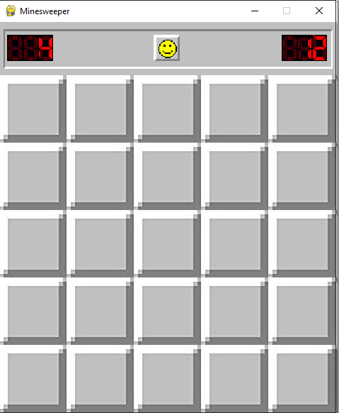
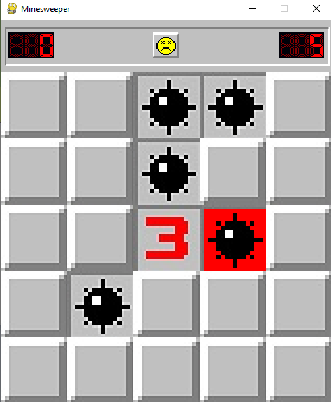
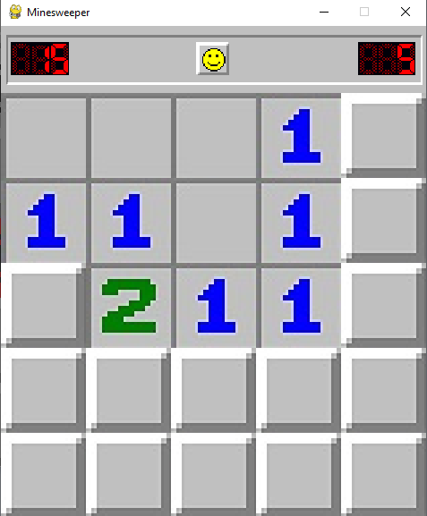
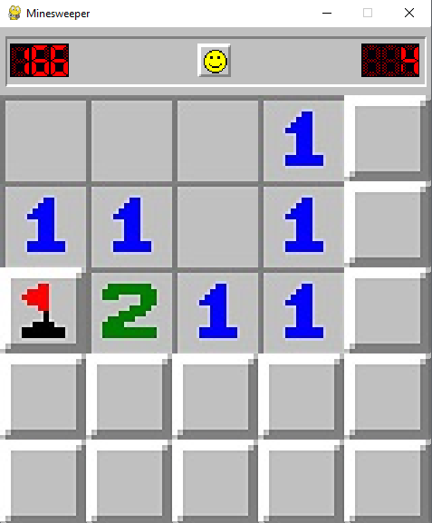
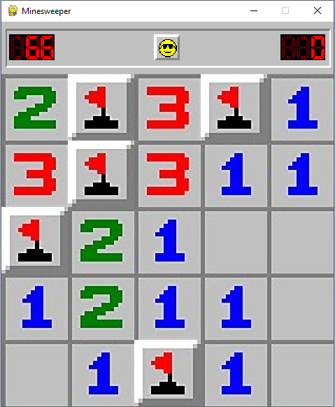
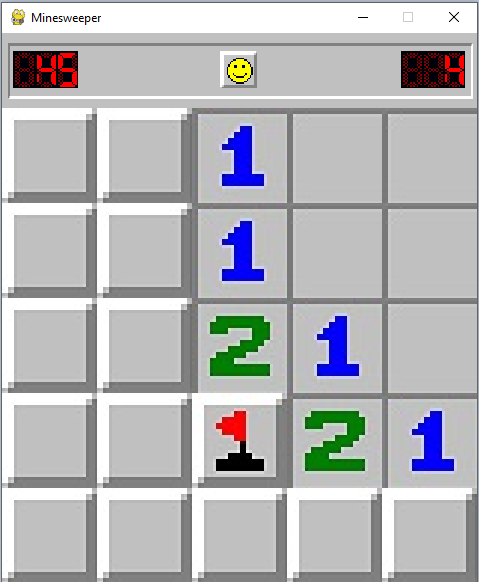
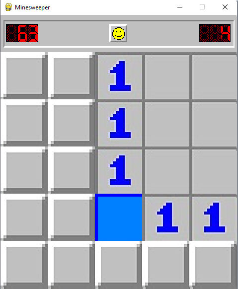

# Minesweeper_py
A pygame recreation of the classic game Minesweeper, with some added convenience features.

## Getting Started
You will need an up-to-date installation of python (this game was designed using Python 3)
You can find this on the [official website](https://www.python.org/downloads/).

This project requires the use of external packages to run. Fortunately, these are logged in `requirements.txt`. To install the needed packages, run the following from the terminal:
```
pip3 install -r requirements.txt
```

## Start Menu
* Start Game - Begins Game
* Settings - Opens Settings
* Exit - Closes window

## Settings
In this screen, adjust settings that will control elements of the game and display
* Mines - Number of mines on the map
* Rows - Number of rows in grid
* Columns - Number of columns in grid
* Screen Size - Maximum grid dimension
  * If fullscreen is not enabled, the screen will automatically size to fit the size of grid under the 'Rows' and 'Columns' headers.
  * The maximum auto-sized dimension is what is detailed here
  * NOTE: This parameter is ignored when fullscreen is toggled ON
* Fullscreen - Toggles if the game will open in fullscreen mode

## Game

### Controls
#### Interface Controls
* Face Button - Resets the game
* Grid Tile - 

#### Keyboard Controls
* Escape - Exit to Main Menu
* R - Reset game grid

### Goal
In minesweeper, you are presented a grid of tiles with the goal of digging up every tile that does not contain a mine.



### Digging
To "dig" a tile, left click on it. This will reveal the tile's contents, which can contain one of two things:
1. A mine
2. A number 

Digging up a mine blows us up and loses the game, so we will try to avoid that.



Digging up a number gives us a clue as to how we can: that number indicates how many mines are in tiles immediately bordering that one (all cardinal directions + diagonals). 

Note that a blank tile is effectively showing 0. In addition, minesweeper has a neat behavior where digging up a 0 will automatically dig up all other tiles around it, as they are all guaranteed to be safe. This trigger more 0s, and result in a large number of squares being dug up at once.



### Flagging
If you are certain of the location of a mine and want to ensure you won't accidentally click it later, you can right-click to add a flag to a tile.
This will render the tile un-clickable, and decrement the mine counter in the top right. (You can use this indicator
to track your progress in the current game.)



### Winning
Once all non-mine tiles are dug, you win the game! The face at the top will don sunglasses, and you 
will no longer feel like a disappointment.



At this point, you can proceed in one of 3 ways:

1. Click the face to start a new game
2. Press "R" to start a new game
3. Press "Escape" to exit to the main menu

### "Committing" mines
For a unique spin on the gameplay of minesweeper, this project has added a functionality to "commit" (or remove) mines from the grid.

Here's how it works:
* Flag a tile you are sure is a mine
* Right-click on the face at the top
* If the flagged tile contains a mine, the mine will be removed from the grid and replaced with a blue square.
  * Since the mine is now gone, the numbers indicated in the tiles surrounding will be adjusted to account for this.
  * Since this can result in new blank tiles, this also triggers the automatic blank-digging for new blank tiles
* If the flagged tile did NOT have a mine, you lose the game.





Note that this function adds no new information to the player. 
It simply makes the existing game state more visually digestible while removing
some of the more tedious logical steps.


## Packages used
* [pygame](https://www.pygame.org) - Display screen and interaction
* [matplotlib](https://matplotlib.org) - Made use of colormaps to style menus